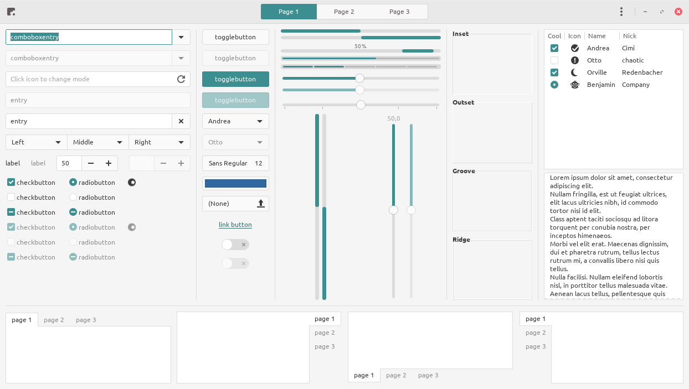
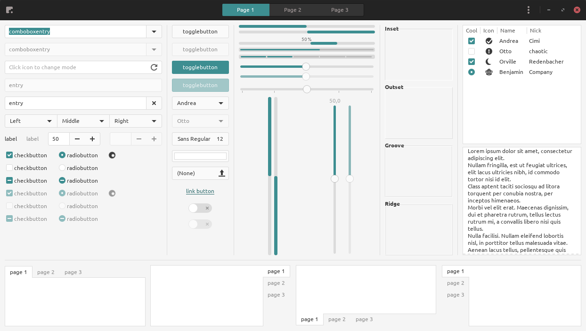
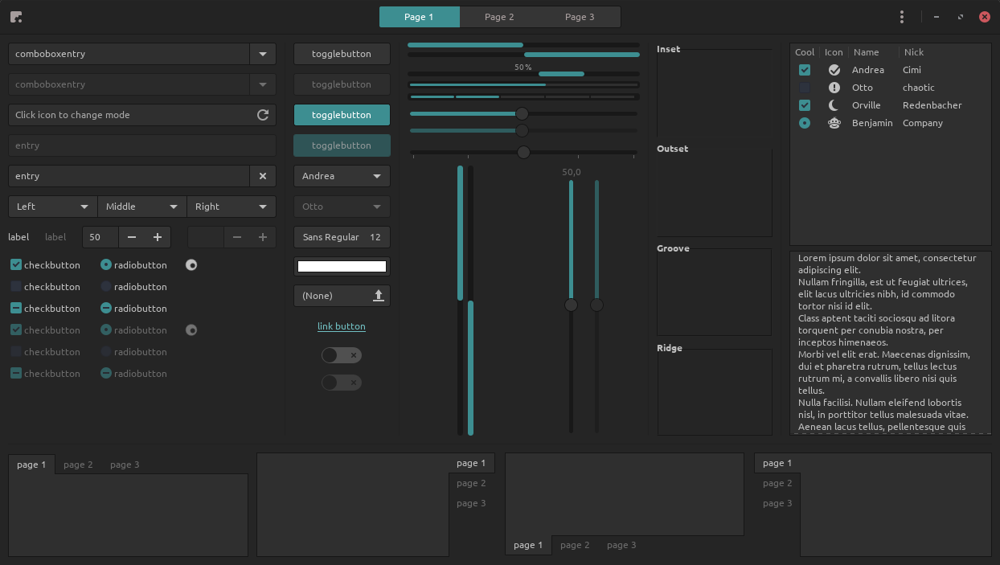

# Arc Theme Generator
This script let you replace colors in the arc-theme by updating every `.scss`, `.svg`, `.xml`, `.rc` and `gtkrc` files and re-rendering assets

## Prerequisites
-   Inkscape
-   Optipng

## Usage
1. Clone the arc-theme repository
2. Run arc-theme-generator
3. Then you can follow the installation procedure in the arc-theme README.

```sh
git clone https://github.com/NicoHood/arc-theme

# Only change the main color to red
./arc-theme-generator.py -c "#cc575d" arc-theme

# Change the main color to green (Screenshots below)
# Change all background/header to black
# Remove all bold font 
./arc-theme-generator.py -c "#3D8E91" --variant "black" --without-bold arc-theme
```

If you want to generate a new theme you need to reset all modification in the arc-theme repository with a `git reset --hard`.

## Screenshot
### Arc

### Arc-Darker

### Arc-Dark


## Optional arguments
|Option|Description|
|-|-|
|`--color`| Change the main color|
|`--variant` | Change the color of the header and the background. There is currently 2 variant (black and grey) |
|`--without-bold`| Remove the `font-weight: bold` in the css
|`--no-assets`| Rendering assets can be very long, this option is useful if you want to quickly test a color with the default assets  |
|`--threads`| Number of threads when rendering assets |